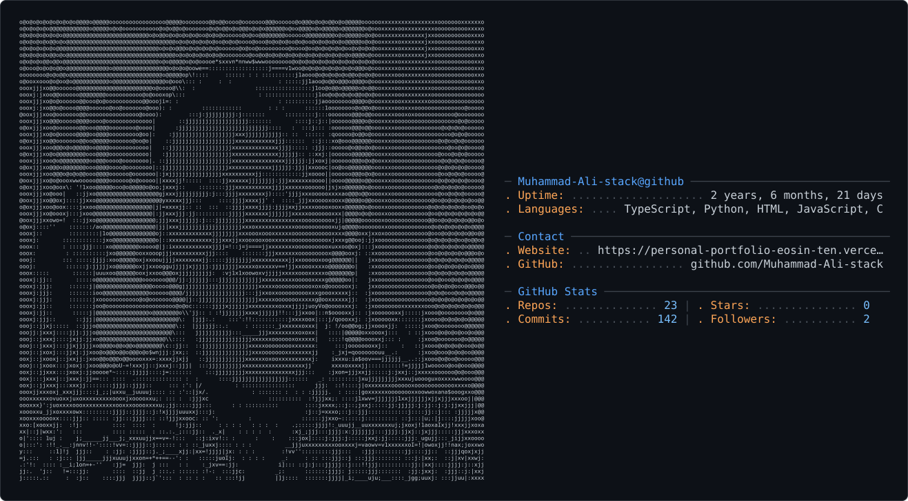

<div align="center">

<picture>
  <source media="(prefers-color-scheme: dark)" srcset="dark_mode.svg" />
  <source media="(prefers-color-scheme: light)" srcset="light_mode.svg" />
  
</picture>


<br/>

[](https://www.linkedin.com/in/muhammad-ali-50159b2b1/)
[](https://personal-portfolio-eosin-ten.vercel.app/)
[](mailto:muhammadbvs2021@gmail.com)
[](https://github.com/Muhammad-Ali-stack)
[](https://leetcode.com/Muhammad_Ali2023/)

</div>

---

## `whoami`

```typescript
const dev = {
  role        : "App & Web Developer | SaaS Builder | LLM/AI Developer",
  experience  : "3.5+ years in production (CloudJunction Advisors, NED University)",
  focus       : ["Cross-Platform Apps (Flutter, React Native, Expo, Swift)", "Full-Stack Web & SaaS", "LLM/AI Systems", "Backend & Fintech APIs"],
  currently   : "Building mobile apps, SaaS platforms, and LLM-powered products end to end",
  education   : "B.S. Computer Science @ NED University (Expected June 2027)",
  achievements: [
    "Shipped PaperDesk to 15,500+ real users (ICONICS Conference Management Portal)",
    "8,000+ combined downloads across published Play Store apps",
    "2nd & 3rd place, competitive programming (FAST WebHunt)",
    "IELTS Band 7 (C1 English)",
    "Microsoft Azure Fundamentals (AZ-900)",
  ],
  superpower  : "Shipping apps and backends where every transaction is safe, every ledger balances, and every API survives at scale",
};
```

---

## What I Do

```
One idea. One codebase philosophy. Every platform.
Flutter and React Native for mobile.
Expo for fast iteration and OTA updates.
Swift for native iOS when it matters.
A full web/SaaS stack behind all of it.
LLMs woven in wherever they add real value.

That's the range I build in.
```

I ship across the whole surface: mobile apps (Flutter, React Native, Expo, native Swift), full-stack web and SaaS products, and LLM/AI-powered features baked into real products, not bolted on. 3.5+ years of production experience taught me how to take a product from idea to app store to paying users, with AI as a first-class part of the stack, not an afterthought.

---

## What I've Shipped

> Real production systems. Real users. Real accountability.

| Project | What it does | Scale | Stack |
|---|---|---|---|
| **PaperDesk** | Conference management platform: submissions, review, scheduling, admin workflows | **15,500+ users**, [paperdesk.neduet.edu.pk](https://paperdesk.neduet.edu.pk) | React · Express · Supabase |
| **AlphaSignal** | AI financial intelligence platform, analyzes SEC EDGAR earnings calls with RAG, vector search & LLM sentiment extraction | Production | Python · RAG · Vector DBs · LLMs |
| **Clearledger-BE** | Double-entry ledger backend with idempotent transactions, reconciliation engine, and audit trail | Fintech-grade | Node.js · TypeScript · PostgreSQL |
| **Stratum-AI** | Full-stack CRM assistant integrating Salesforce, HubSpot, ServiceNow with AI-driven query layer | Enterprise | React · TypeScript · Express · Supabase |
| **CRM-Mind** | Natural language Salesforce interface: create, update, query records via LLM | Enterprise | Node.js · TypeScript · Groq · LangChain |
| **Ambition & NEDIAN** | Role-based mobile apps published on Google Play | 8,000+ combined downloads | React Native · Kotlin · Firebase |
| **AI Data (RAG) Service** | Access-scoped CRM data retrieval exposed to enterprise LLMs, rate limiting, context chunking | Enterprise-grade | Node.js · LangChain · Vector DBs |

---

## What I Build Across

```
┌─────────────────────────────────────────────────────────────────────┐
│                       Systems I Build                               │
├──────────────────┬───────────────────┬──────────────────────────────┤
│  Cross-Platform  │  Web & SaaS       │   LLM & AI Systems           │
│  Apps            │                   │                              │
│  Flutter         │  Full-Stack Web   │  RAG Pipelines               │
│  React Native    │  SaaS Backends    │  Vector-Based Retrieval      │
│  Expo            │  Payment Systems  │  LLM-Powered Features        │
│  Swift (iOS)     │  Auth & APIs      │  AI Agents & MCP             │
│  Play + App Store│  Multi-Tenant     │  Sentiment/Data Extraction   │
└──────────────────┴───────────────────┴──────────────────────────────┘
```

---

## Tech Stack

<div align="center">

**App Development (Mobile & Cross-Platform)**


**Web & SaaS**


**LLM & AI Development**


**Enterprise Integrations**


**Cloud, Data & DevOps**


</div>

---

## By The Numbers

<div align="center">

| | | | |
|:---:|:---:|:---:|:---:|
| **3.5+** | **15,500+** | **3** | **2** |
| Years in Production | Real Users Served (PaperDesk) | Mobile Apps Shipped | SaaS Platforms |
| | | | |
| **Top 3** | **Band 7** | **AZ-900** | **$0 → Live** |
| Competitive Programming | IELTS English | Azure Certified | Products Built from Scratch |

</div>

---

## GitHub Activity

<div align="center">
  
</div>

---

## How I Work

```
Problem  →  System Design  →  Clean Architecture  →  Ship  →  Measure  →  Iterate
```

I think in platforms and failure modes before I write a line of code. Same product logic, shipped natively on iOS with Swift, cross-platform with Flutter or React Native and Expo, and as a full web/SaaS product, with LLMs wired in wherever they genuinely improve the product. Every API I design is idempotent by default. Every transaction is atomic or it rolls back. Every feature is built to ship to real users, not just demo well.

That's not caution. That's craft.

---

<div align="center">

**Building apps, web platforms, and AI products across every stack. Let's talk.**

[](mailto:muhammadbvs2021@gmail.com)

<sub>3.5+ years in. shipped to 15,500+ real users. still hungry.</sub>

</div>

---

## 🏆 Achievements

<div align="center">
  
  
  
</div>
